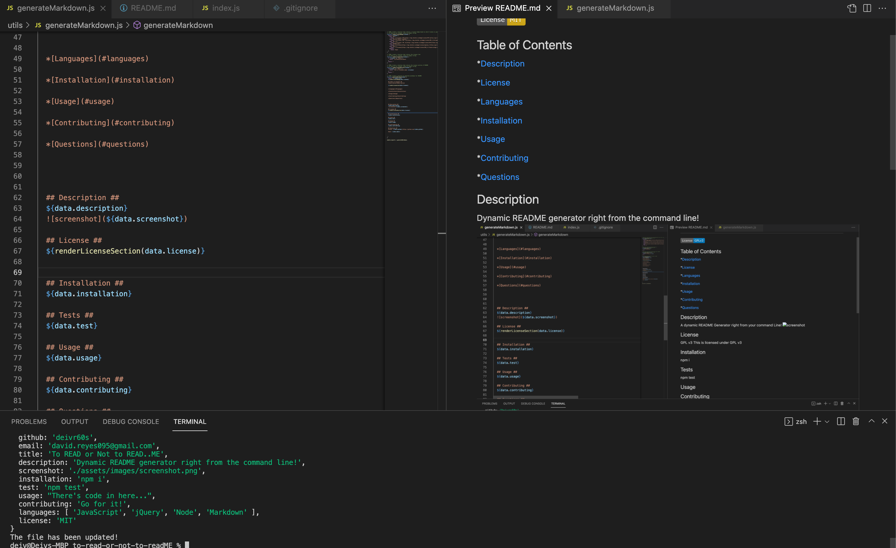

# To READ or not to READ...ME
  None
  
  ## Table of Contents ##
  *[Description](#description)

  *[License](#license)

  *[Languages](#languages)

  *[Installation](#installation)

  *[Usage](#usage)

  *[Contributing](#contributing)

  *[Questions](#questions)

  ## Description ##
  A dynamic README Generator right from your command line!
  
  
  LINK TO VIDEO WALKTHROUGH: 
  https://drive.google.com/file/d/1Q0QAOEmxkLzbjcCzOMqcT3REVDJRmNa4/view

  ## License ##
  This is licensed under BSD3
  

  ## Installation ##
  npm i

  ## Tests ##
  npm test

  ## Usage ##
  There's code in here..

  ## Contributing ##
  Go for it!

  ## Questions ##
  Github: [deivr60s](https://github.com/deivr60s)

  Email: david.reyes095@gmail.com

  
